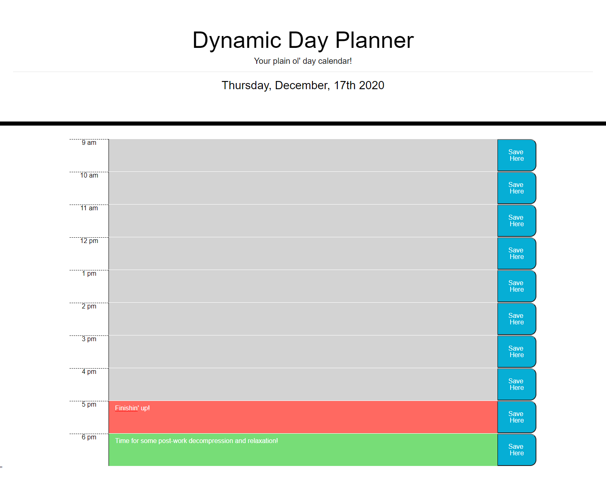

# A Dynamic Day Planner

## Description

For this assignment, we built a simple site that a user can plan their day with. We dynamically built blocks for each hour throughout the work day that a user can fill and save using local storage. To help the user keep track of their agenda, the blocks will change color as time passes. The current hour block is colored red, blocks that have already passed will turn grey and blocks in the future are colored green. 

---------------------------

The deployed and functional site can be found here: <https://spencerv86.github.io/dynamic-day-planner/>

The full process can be found on my [Github](https://github.com/spencerv86/dynamic-day-planner) repository linked here:
<https://github.com/spencerv86/dynamic-day-planner>

----------------
## Table of Contents

* [Installation](#installation)
* [Usage](#usage)
* [Credits](#credits)
* [License](#license)

------------
## Installation

To install, fork repository [found here](https://github.com/spencerv86/dynamic-day-planner), then clone to your computer and open in Visual Studio Code or your preferred interface. 

If you'd simply likely to visit the site in action, you can find it [here.](https://spencerv86.github.io/dynamic-day-planner/)

------------
## Usage
To use, simply click the text box next to the hour you are planning for and enter text, then click the corresponding save button. This will allow you to revisit or refresh the site and maintain the events you have entered. 

Warning! This site only utilizes local storage to save your day and will not be re-accessible on different computers or browsers than the one you made your plans on.

-----------
## Credits

Thanks to the members of my cohort and my helpful TAs for their tips and assistance along the way!

------------
## License

MIT License

Copyright (c) [2020] [Spencer Vaughan]

Permission is hereby granted, free of charge, to any person obtaining a copy
of this software and associated documentation files (the "Software"), to deal
in the Software without restriction, including without limitation the rights
to use, copy, modify, merge, publish, distribute, sublicense, and/or sell
copies of the Software, and to permit persons to whom the Software is
furnished to do so, subject to the following conditions:

The above copyright notice and this permission notice shall be included in all
copies or substantial portions of the Software.

THE SOFTWARE IS PROVIDED "AS IS", WITHOUT WARRANTY OF ANY KIND, EXPRESS OR
IMPLIED, INCLUDING BUT NOT LIMITED TO THE WARRANTIES OF MERCHANTABILITY,
FITNESS FOR A PARTICULAR PURPOSE AND NONINFRINGEMENT. IN NO EVENT SHALL THE
AUTHORS OR COPYRIGHT HOLDERS BE LIABLE FOR ANY CLAIM, DAMAGES OR OTHER
LIABILITY, WHETHER IN AN ACTION OF CONTRACT, TORT OR OTHERWISE, ARISING FROM,
OUT OF OR IN CONNECTION WITH THE SOFTWARE OR THE USE OR OTHER DEALINGS IN THE
SOFTWARE.